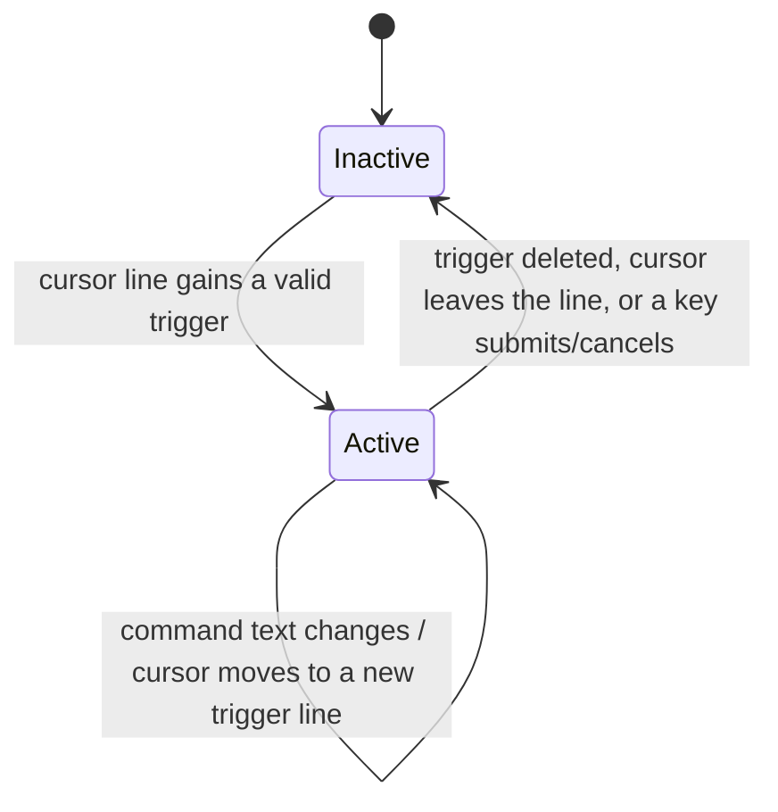

Notion、Slack、Linear のようなエディタでは、トリガー文字（`/`、`@`、あるいは `@@` のようなマーカー）を入力すると一時的な「コマンド」モードに入ります。小さな UI が現れ、特定のキーの意味が変わり、カーソルを離すかトリガーを削除した瞬間にモードが消えます。このレシピでは、その仕組みを CodeMirror 6 で **`transactionExtender` 駆動のステートマシン** として構築する方法を示します。エディタの _モード_ を、ドキュメントそのものからトランザクションごとに導出するアプローチです。

中心となる考え方は次のとおりです。

- **編集からモードを原子的に導出する。** `transactionExtender` がすべてのトランザクションを検査し、モードを変更するエフェクトを _その同じトランザクション_ に追加します。これにより、キャプチャ状態がドキュメントから 1 フレーム遅れることが決して起きません。
- **高コストなチェックを安価なチェックの後ろにガードする。** `String.includes("@@")` のテストはキーストロークごとに走りますが、正規表現マッチと `syntaxTree` のフェンスコード走査は、すでにマーカーを含む稀な行でのみ走ります。
- **アクティブな間だけキーを横取りする。** `Prec.highest` のキーマップがキャプチャ中は `Tab` / `Mod-Enter` / `Escape` を要求し、それ以外のときは `false` を返してデフォルトのバインディングへフォールスルーします。
- **行末のピル + 行ハイライトをレンダリングする。** 1 つの `decorations.compute([field, composingField])` が 2 つのフィールドを同時に読み取って描画します。

このページは他の 2 つのレシピの上に直接構築されます。末尾の IME・スタールレスポンスのセクションが、それらがどう噛み合うかを説明します。

<Info>

[トランザクション](../core/transactions.mdx) のページでは `transactionExtender` の _API_ をタイムスタンプの例で説明しています。このレシピでは同じプリミティブを別の目的に使います。すなわち、トランザクションごとにエディタの _モード_ をドキュメントから導出することです。`transactionExtender` が初めてなら、まずそのページを読んでください。

</Info>

## ステートマシン

このキャプチャ機構はちょうど 2 つの状態 — 非アクティブ（通常の編集）とアクティブ（コマンドのキャプチャ中）— を持ちます。あらゆるトランザクションが遷移を引き起こしえます。



状態は単一の `StateField` でモデル化します。その形は UI とダウンストリームのハンドラが必要とするすべてを保持します。

```ts
import { StateEffect, StateField } from "@codemirror/state";

export interface CaptureState {
  active: boolean;
  lineFrom: number; // absolute offset of the captured line's start
  command: string; // live text after the trigger marker
  requestId: number; // bumped on every enter — see the stale-response recipe
}

export const enterCapture =
  StateEffect.define<{ lineFrom: number; command: string }>();
export const setCommandText =
  StateEffect.define<{ lineFrom: number; command: string }>();
export const exitCapture = StateEffect.define<null>();

export const captureField = StateField.define<CaptureState>({
  create: () => ({ active: false, lineFrom: 0, command: "", requestId: 0 }),

  update(value, tr) {
    let next = value;
    for (const e of tr.effects) {
      if (e.is(enterCapture)) {
        // Bump requestId on every enter so any in-flight async response
        // from a previous capture can be filtered out downstream.
        next = {
          active: true,
          lineFrom: e.value.lineFrom,
          command: e.value.command,
          requestId: next.requestId + 1,
        };
      } else if (e.is(setCommandText) && next.active) {
        next = { ...next, lineFrom: e.value.lineFrom, command: e.value.command };
      } else if (e.is(exitCapture)) {
        // Preserve requestId so a stale response to the just-exited capture
        // is still rejected.
        next = { ...next, active: false, lineFrom: 0, command: "" };
      }
    }
    return next;
  },
});
```

このフィールドはエフェクトに _反応する_ だけです。いつ開始・終了するかを自分で決めることは決してありません。その判断は `transactionExtender` の責務です。次にそれを見ていきます。

## 遷移を原子的に駆動する

素朴なやり方は、`view.updateListener` を追加し、新しい状態を読み取り、2 つ目のトランザクションを `dispatch` してモードを切り替えることです。これでも動きますが、1 つの論理的な変更を 2 つのトランザクションに分割してしまいます。1 フレームのあいだ、ドキュメントにはトリガーが含まれているのにモードはまだ非アクティブ、という状態になります。アンドゥ/リドゥ、デコレーション、その他あらゆるリスナーが、この一貫性のない中間状態を目にしてしまいます。

`transactionExtender` はその隙間をなくします。トランザクションが構築されている最中に走り、エフェクトを _その同じトランザクション_ に追加できます。これにより、モード変更がそれを引き起こした編集と原子的に着地します。

```ts
import { EditorState } from "@codemirror/state";
import { detectTriggerOnLine, isInFencedCode } from "./trigger-detect.js";

const triggerDetector = EditorState.transactionExtender.of((tr) => {
  // Only re-evaluate when something user-visible changed.
  const justEndedComposing =
    tr.startState.field(composingField) && !tr.state.field(composingField);
  const shouldRecheck =
    tr.docChanged || tr.selection !== undefined || justEndedComposing;
  if (!shouldRecheck) return null;

  // Suspend trigger detection during IME composition (see the IME recipe).
  if (tr.state.field(composingField)) return null;

  const current = tr.state.field(captureField);
  const head = tr.state.selection.main.head;
  const line = tr.state.doc.lineAt(head);

  // --- Fast path: the cheap precheck. -----------------------------------
  // String.includes runs on EVERY keystroke. The regex match and the
  // isInFencedCode syntaxTree walk below only run on the rare line that
  // already contains the marker. This is the whole performance trick.
  if (!line.text.includes("@@")) {
    // The line is clean. If we were capturing, the user just deleted the
    // trigger or the cursor left the line — exit.
    if (current.active) return { effects: exitCapture.of(null) };
    return null;
  }

  // --- Slow path: only reached when the marker is present. --------------
  const match = detectTriggerOnLine(line.text, line.from);
  const inCode = match ? isInFencedCode(tr.state, line.from) : false;

  if (match && !inCode) {
    if (!current.active) {
      return {
        effects: enterCapture.of({
          lineFrom: match.lineFrom,
          command: match.command,
        }),
      };
    }
    if (current.lineFrom !== line.from) {
      // Cursor moved into a DIFFERENT trigger line — re-enter so requestId
      // bumps and the stale command text is cleared.
      return {
        effects: [
          exitCapture.of(null),
          enterCapture.of({ lineFrom: match.lineFrom, command: match.command }),
        ],
      };
    }
    if (current.command !== match.command) {
      return {
        effects: setCommandText.of({
          lineFrom: match.lineFrom,
          command: match.command,
        }),
      };
    }
    return null; // same line, same text — nothing to do
  }

  // Marker present but not a valid trigger (e.g. inside fenced code).
  if (current.active) return { effects: exitCapture.of(null) };
  return null;
});
```

<Tip>

`transactionExtender` から `null` を返すのは最も多いケースで、コストはゼロです。元のトランザクションがそのまま素通りします。エフェクトを返すとそれが追加され、フィールドの `update` は、すでに反復している _同じ_ `tr.effects` のなかでそれを目にします。

</Tip>

### なぜプレチェックが重要なのか

`isInFencedCode` は、カーソル行が Markdown のコードフェンス内（そこでは `@@` は無効であるべき）に位置するかを判定するために構文木を走査します。木の走査は単体では安価ですが、`transactionExtender` は _あらゆる_ トランザクション — キーストロークごと、カーソル移動ごと、選択のドラッグごと — で発火します。99% の行が決してマーカーを含まないのに、そのたびに木の走査を走らせるのは無駄な仕事です。

`line.text.includes("@@")` は 1 回の部分文字列スキャンです。ユーザーが通常の文章を入力している圧倒的に多いケースでは、これがスローパス全体をショートサーキットします。マーカーが実際にカーソル行に現れたときに初めて、正規表現と木の走査のコストを払います。

これは再利用可能なパターンです。**安価で保守的なプレチェックによって、ホットパスでの高コストな解析をスキップする** という考え方です。プレチェックは決して偽陰性を生んではなりません。`@@` が有効なトリガーの一部でありうるなら、`includes("@@")` はそれを通過させなければなりません。

## 条件付きでフォールスルーするキーマップ

キャプチャ中、`Tab`・`Mod-Enter`・`Escape` はそれぞれ「インライン送信」「パネルを開く」「キャンセル」を意味します。それ以外のときは、デフォルトの意味（インデントなど）を保たねばなりません。コツは、ハンドラが **キャプチャが非アクティブのときに `false` を返す** `Prec.highest` のキーマップです。これにより CodeMirror はより低い優先度のバインディングへフォールスルーします。

```ts
import { Prec } from "@codemirror/state";
import { EditorView, keymap } from "@codemirror/view";

interface Handlers {
  insertShortcut: string; // e.g. "Mod-j"
  submitInline: (p: SubmitPayload) => void;
  submitPanel: (p: SubmitPayload) => void;
  cancel: (p: { view: EditorView; lineFrom: number }) => void;
}

function buildKeymap(opts: Handlers) {
  const submit =
    (handler: (p: SubmitPayload) => void) => (view: EditorView): boolean => {
      const cs = view.state.field(captureField);
      if (!cs.active) return false; // fall through to default binding
      handler({
        view,
        lineFrom: cs.lineFrom,
        command: cs.command,
        requestId: cs.requestId,
      });
      view.dispatch({ effects: exitCapture.of(null) });
      return true; // handled — stop here
    };

  return [
    { key: "Tab", run: submit(opts.submitInline) },
    { key: "Mod-Enter", run: submit(opts.submitPanel) },
    {
      key: "Escape",
      run(view: EditorView) {
        const cs = view.state.field(captureField);
        if (!cs.active) return false;
        opts.cancel({ view, lineFrom: cs.lineFrom });
        view.dispatch({ effects: exitCapture.of(null) });
        return true;
      },
    },
    {
      key: opts.insertShortcut,
      run(view: EditorView) {
        const cs = view.state.field(captureField);
        if (cs.active) return false; // already capturing — fall through
        if (view.state.field(composingField)) return false;
        // Insert the marker; the transactionExtender on THIS dispatch enters
        // capture mode for us — no manual enterCapture needed.
        const head = view.state.selection.main.head;
        const line = view.state.doc.lineAt(head);
        const before = view.state.doc.sliceString(line.from, head);
        const insert = /^[ \t]*$/.test(before) ? "@@ " : "\n@@ ";
        view.dispatch({
          changes: { from: head, insert },
          selection: { anchor: head + insert.length },
        });
        return true;
      },
    },
  ];
}
```

<Warning>

無条件に `true` を返す `Prec.highest` のキーマップは、エディタ全体で `Tab` と `Escape` を飲み込んでしまい、インデントやその他の `Escape` 駆動の機能を壊します。`if (!cs.active) return false` のガードこそが、高優先度のバインディングを安全にするものです。アクティブな状態でのみキーを要求し、それ以外では存在しないかのように振る舞います。

</Warning>

`insertShortcut` ハンドラに注目してください。これはドキュメントの変更だけを dispatch します。`transactionExtender` はまさにそのトランザクション上で走り、挿入されたばかりの `@@` を見て、`enterCapture` を自ら追加します。キーマップは手動でキャプチャモードに入ることは決してありません。ステートマシンが編集の帰結としてそれを行います。これがまさに、私たちが望む原子性の保証です。

## レンダリング: 1 つの compute からピルウィジェット + 行デコレーション

アクティブな状態では 2 つのものを表示します。キャプチャ行のハイライトと、利用可能なキーを示す行末の小さな「ピル」です。どちらもフィールドの `provide` で宣言された 1 つの `decorations.compute` から生まれます。重要なのは、それが **2 つのフィールド** — キャプチャ状態 _と_ IME コンポジションフラグ — を読み取ることです。これによりピルはコンポジション中に自分をグレーアウトできます。

```ts
import { Decoration, EditorView, WidgetType, type DecorationSet } from "@codemirror/view";

class StatusPillWidget extends WidgetType {
  constructor(readonly composing: boolean) {
    super();
  }
  eq(other: StatusPillWidget) {
    return this.composing === other.composing;
  }
  toDOM() {
    const span = document.createElement("span");
    span.className = "cm-inline-command-pill";
    if (this.composing) span.classList.add("cm-inline-command-pill--composing");
    span.setAttribute("aria-hidden", "true");
    span.textContent = "Tab insert · ⌘↵ panel · Esc cancel";
    return span;
  }
  ignoreEvent() {
    return true;
  }
}

// Inside captureField's definition:
provide(field) {
  return EditorView.decorations.compute([field, composingField], (state): DecorationSet => {
    const cs = state.field(field);
    if (!cs.active) return Decoration.none;
    if (cs.lineFrom < 0 || cs.lineFrom > state.doc.length) {
      return Decoration.none; // defensive clamp — the line may have been deleted
    }
    const line = state.doc.lineAt(cs.lineFrom);
    const composing = state.field(composingField);
    return Decoration.set(
      [
        Decoration.line({ attributes: { class: "cm-inline-command-line" } }).range(line.from),
        Decoration.widget({ widget: new StatusPillWidget(composing), side: 1 }).range(line.to),
      ],
      true, // ranges are already sorted
    );
  });
}
```

依存リストとして `[field, composingField]` を宣言すると、_いずれか_ のフィールドが変化するたびにデコレーションが再計算されます。これによって、キャプチャフィールドがコンポジションフラグを自分の形にミラーすることなく、ピルが IME コンポジションに反応できます。この複数入力の `decorations.compute` 自体が再利用可能なパターンです。IME レシピがこれを詳しく説明しています。末尾を参照してください。

ウィジェット、行デコレーション、`decorations.compute` 一般の入門は、[カスタム拡張](../extensions/custom-extensions.mdx) を参照してください。

## すべてを組み立てる

```ts
import { Prec } from "@codemirror/state";
import { keymap } from "@codemirror/view";

export function inlineCommandExtension(opts: Handlers) {
  return [
    composingField, // IME composing flag (shared with the ghost-text extension)
    captureField, // capture state + decorations via provide()
    triggerDetector, // the transactionExtender state machine
    Prec.highest(keymap.of(buildKeymap(opts))),
    composingHandlers, // DOM listeners that flip composingField
  ];
}
```

ここでは配列の順序は正しさに影響しません。`transactionExtender` は常にフィールドの更新前に走り、`Prec.highest` は位置に関係なくキーマップをデフォルトの上へ持ち上げます。とはいえ、ステートマシンの部品をまとめておくと、拡張を 1 つのまとまりとして読みやすくなります。

## IME・スタールレスポンスレシピの再利用

このレシピは、それぞれ独自のページを持つ 2 つの関心事の境界で意図的に立ち止まります。

- **IME コンポジションゲーティング。** `composingField`、`compositionstart` / `compositionend` の DOM ハンドラ、そして「コンポジション中にモードを遷移させない」というルールは、すべて [IME コンポジションゲーティング](./ime-composition-gating.mdx) に由来します。そのページはまた、**複数フィールドを共有する `decorations.compute` のコールアウト** — 1 つの compute が複数のフィールドを同時に読み取るパターン、まさに上記のピルがコンポジションフラグに反応する仕組み — を説明しています。コンポジションがステートマシンを停止させなければならない理由の完全な解説については、そのページを読んでください。
- **スタールな非同期レスポンスの拒否。** `enterCapture` のたびにインクリメントされる `requestId` カウンタは、[スタールな非同期レスポンスの拒否](./stale-response-rejection.mdx) のためのフックです。送信ハンドラが非同期リクエスト（LLM 呼び出し、fetch）を発行するとき、レスポンスはユーザーがすでにキャンセルしたか新しいキャプチャを開始した後に届くかもしれません。レスポンスの `requestId` をフィールドの現在の `requestId` と比較すれば、スタールなものを破棄できます。このレシピはカウンタを _インクリメントする_ だけです。そのページがそれを _使う_ 方法を示します。

3 つのレシピは合わさって完全なインラインコマンド機構を構成します。このページがステートマシン、IME ゲーティングがコンポジション中の健全性を保ち、スタールレスポンスの拒否が非同期結果を誤った場所に着地させないようにします。
