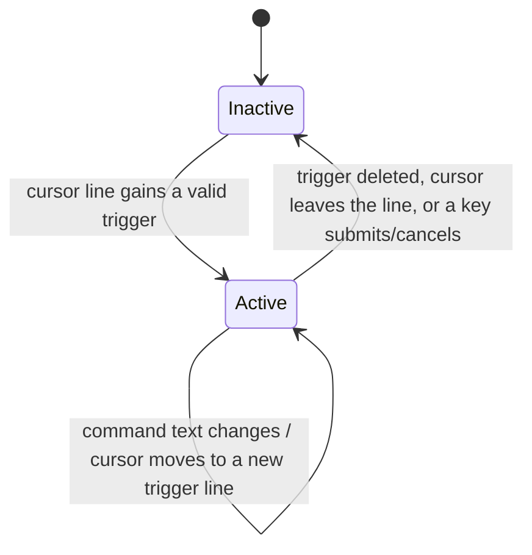

Editors like Notion, Slack, and Linear let you type a trigger character (`/`, `@`, or a marker like `@@`) to drop into a transient "command" mode: a small UI appears, certain keys change meaning, and as soon as you move the cursor away or delete the trigger, the mode disappears. This recipe shows how to build that surface in CodeMirror 6 as a **state machine driven by `transactionExtender`** — where the editor's _mode_ is derived from the document itself, transition by transition.

The core ideas:

- **Derive the mode from the edit, atomically.** A `transactionExtender` inspects every transaction and appends the mode-changing effect to _that same transaction_, so the capture state can never lag a frame behind the document.
- **Guard the expensive check behind a cheap one.** A `String.includes("@@")` test runs on every keystroke; the regex match and the `syntaxTree` fenced-code walk run only on the rare line that already contains the marker.
- **Intercept keys only while active.** A `Prec.highest` keymap claims `Tab` / `Mod-Enter` / `Escape` when capturing, and returns `false` to fall through to the default bindings the rest of the time.
- **Render an end-of-line pill + line highlight** from a single `decorations.compute([field, composingField])` that reads two fields at once.

This page builds directly on two other recipes — the IME and stale-response sections at the end explain how they fit together.

<Info>

The [Transactions](../core/transactions.mdx) page documents the `transactionExtender` _API_ with a timestamp example. This recipe uses the same primitive for a different job: deriving an editor _mode_ from the document on every transaction. Read that page first if `transactionExtender` is new to you.

</Info>

## The State Machine

The capture surface has exactly two states — inactive (normal editing) and active (capturing a command). Every transaction can drive a transition:



We model the state as a single `StateField`. The shape carries everything the UI and downstream handlers need:

```ts
import { StateEffect, StateField } from "@codemirror/state";

export interface CaptureState {
  active: boolean;
  lineFrom: number; // absolute offset of the captured line's start
  command: string; // live text after the trigger marker
  requestId: number; // bumped on every enter — see the stale-response recipe
}

export const enterCapture =
  StateEffect.define<{ lineFrom: number; command: string }>();
export const setCommandText =
  StateEffect.define<{ lineFrom: number; command: string }>();
export const exitCapture = StateEffect.define<null>();

export const captureField = StateField.define<CaptureState>({
  create: () => ({ active: false, lineFrom: 0, command: "", requestId: 0 }),

  update(value, tr) {
    let next = value;
    for (const e of tr.effects) {
      if (e.is(enterCapture)) {
        // Bump requestId on every enter so any in-flight async response
        // from a previous capture can be filtered out downstream.
        next = {
          active: true,
          lineFrom: e.value.lineFrom,
          command: e.value.command,
          requestId: next.requestId + 1,
        };
      } else if (e.is(setCommandText) && next.active) {
        next = { ...next, lineFrom: e.value.lineFrom, command: e.value.command };
      } else if (e.is(exitCapture)) {
        // Preserve requestId so a stale response to the just-exited capture
        // is still rejected.
        next = { ...next, active: false, lineFrom: 0, command: "" };
      }
    }
    return next;
  },
});
```

The field only ever _reacts_ to effects. It never decides on its own when to enter or exit — that decision belongs to the `transactionExtender`, which we look at next.

## Driving Transitions Atomically

The naive approach is to add a `view.updateListener`, read the new state, and `dispatch` a second transaction to flip the mode. That works, but it splits one logical change across two transactions: for one frame the document contains a trigger while the mode is still inactive. Undo/redo, decorations, and any other listener all see that inconsistent intermediate state.

`transactionExtender` removes the gap. It runs while the transaction is being built and can append effects to _that same transaction_ — so the mode change lands atomically with the edit that caused it.

```ts
import { EditorState } from "@codemirror/state";
import { detectTriggerOnLine, isInFencedCode } from "./trigger-detect.js";

const triggerDetector = EditorState.transactionExtender.of((tr) => {
  // Only re-evaluate when something user-visible changed.
  const justEndedComposing =
    tr.startState.field(composingField) && !tr.state.field(composingField);
  const shouldRecheck =
    tr.docChanged || tr.selection !== undefined || justEndedComposing;
  if (!shouldRecheck) return null;

  // Suspend trigger detection during IME composition (see the IME recipe).
  if (tr.state.field(composingField)) return null;

  const current = tr.state.field(captureField);
  const head = tr.state.selection.main.head;
  const line = tr.state.doc.lineAt(head);

  // --- Fast path: the cheap precheck. -----------------------------------
  // String.includes runs on EVERY keystroke. The regex match and the
  // isInFencedCode syntaxTree walk below only run on the rare line that
  // already contains the marker. This is the whole performance trick.
  if (!line.text.includes("@@")) {
    // The line is clean. If we were capturing, the user just deleted the
    // trigger or the cursor left the line — exit.
    if (current.active) return { effects: exitCapture.of(null) };
    return null;
  }

  // --- Slow path: only reached when the marker is present. --------------
  const match = detectTriggerOnLine(line.text, line.from);
  const inCode = match ? isInFencedCode(tr.state, line.from) : false;

  if (match && !inCode) {
    if (!current.active) {
      return {
        effects: enterCapture.of({
          lineFrom: match.lineFrom,
          command: match.command,
        }),
      };
    }
    if (current.lineFrom !== line.from) {
      // Cursor moved into a DIFFERENT trigger line — re-enter so requestId
      // bumps and the stale command text is cleared.
      return {
        effects: [
          exitCapture.of(null),
          enterCapture.of({ lineFrom: match.lineFrom, command: match.command }),
        ],
      };
    }
    if (current.command !== match.command) {
      return {
        effects: setCommandText.of({
          lineFrom: match.lineFrom,
          command: match.command,
        }),
      };
    }
    return null; // same line, same text — nothing to do
  }

  // Marker present but not a valid trigger (e.g. inside fenced code).
  if (current.active) return { effects: exitCapture.of(null) };
  return null;
});
```

<Tip>

Returning `null` from a `transactionExtender` is the common case and costs nothing — the original transaction passes through unchanged. Returning an effect appends it; the field's `update` then sees it in the _same_ `tr.effects` it is already iterating.

</Tip>

### Why the precheck matters

`isInFencedCode` walks the syntax tree to decide whether the cursor line sits inside a Markdown code fence (where `@@` should be inert). A tree walk is cheap in isolation, but the `transactionExtender` fires on _every_ transaction — every keystroke, every cursor move, every selection drag. Running a tree walk on each of those, when 99% of lines never contain the marker, is wasted work.

`line.text.includes("@@")` is a single substring scan. It short-circuits the entire slow path on the overwhelmingly common case of the user typing ordinary prose. Only once the marker actually appears on the cursor line do we pay for the regex and the tree walk.

This is a reusable pattern: **a cheap, conservative precheck that lets you skip an expensive analysis on the hot path.** The precheck must never produce a false negative — if `@@` can possibly be part of a valid trigger, `includes("@@")` must let it through.

## The Conditionally-Falling-Through Keymap

While capturing, `Tab`, `Mod-Enter`, and `Escape` mean "submit inline", "open panel", and "cancel". The rest of the time they must keep their default meanings (indent, etc.). The trick is a `Prec.highest` keymap whose handlers **return `false` when capture is inactive**, which tells CodeMirror to fall through to lower-precedence bindings.

```ts
import { Prec } from "@codemirror/state";
import { EditorView, keymap } from "@codemirror/view";

interface Handlers {
  insertShortcut: string; // e.g. "Mod-j"
  submitInline: (p: SubmitPayload) => void;
  submitPanel: (p: SubmitPayload) => void;
  cancel: (p: { view: EditorView; lineFrom: number }) => void;
}

function buildKeymap(opts: Handlers) {
  const submit =
    (handler: (p: SubmitPayload) => void) => (view: EditorView): boolean => {
      const cs = view.state.field(captureField);
      if (!cs.active) return false; // fall through to default binding
      handler({
        view,
        lineFrom: cs.lineFrom,
        command: cs.command,
        requestId: cs.requestId,
      });
      view.dispatch({ effects: exitCapture.of(null) });
      return true; // handled — stop here
    };

  return [
    { key: "Tab", run: submit(opts.submitInline) },
    { key: "Mod-Enter", run: submit(opts.submitPanel) },
    {
      key: "Escape",
      run(view: EditorView) {
        const cs = view.state.field(captureField);
        if (!cs.active) return false;
        opts.cancel({ view, lineFrom: cs.lineFrom });
        view.dispatch({ effects: exitCapture.of(null) });
        return true;
      },
    },
    {
      key: opts.insertShortcut,
      run(view: EditorView) {
        const cs = view.state.field(captureField);
        if (cs.active) return false; // already capturing — fall through
        if (view.state.field(composingField)) return false;
        // Insert the marker; the transactionExtender on THIS dispatch enters
        // capture mode for us — no manual enterCapture needed.
        const head = view.state.selection.main.head;
        const line = view.state.doc.lineAt(head);
        const before = view.state.doc.sliceString(line.from, head);
        const insert = /^[ \t]*$/.test(before) ? "@@ " : "\n@@ ";
        view.dispatch({
          changes: { from: head, insert },
          selection: { anchor: head + insert.length },
        });
        return true;
      },
    },
  ];
}
```

<Warning>

A `Prec.highest` keymap that returned `true` unconditionally would swallow `Tab` and `Escape` for the entire editor, breaking indentation and any other `Escape`-driven feature. The `if (!cs.active) return false` guard is what makes a high-precedence binding safe — it claims the key _only_ in the active state and is otherwise invisible.

</Warning>

Note the `insertShortcut` handler: it dispatches only the document change. Because the `transactionExtender` runs on that very transaction and sees the freshly-inserted `@@`, it appends `enterCapture` itself. The keymap never enters capture mode manually — the state machine does it as a consequence of the edit, which is exactly the atomicity guarantee we want.

## Rendering: Pill Widget + Line Decoration From One Compute

The active state shows two things: a highlight on the captured line, and a small "pill" at the end of the line listing the available keys. Both come from a single `decorations.compute`, declared in the field's `provide`. Crucially, it reads **two fields** — the capture state _and_ the IME composing flag — so the pill can grey itself out during composition:

```ts
import { Decoration, EditorView, WidgetType, type DecorationSet } from "@codemirror/view";

class StatusPillWidget extends WidgetType {
  constructor(readonly composing: boolean) {
    super();
  }
  eq(other: StatusPillWidget) {
    return this.composing === other.composing;
  }
  toDOM() {
    const span = document.createElement("span");
    span.className = "cm-inline-command-pill";
    if (this.composing) span.classList.add("cm-inline-command-pill--composing");
    span.setAttribute("aria-hidden", "true");
    span.textContent = "Tab insert · ⌘↵ panel · Esc cancel";
    return span;
  }
  ignoreEvent() {
    return true;
  }
}

// Inside captureField's definition:
provide(field) {
  return EditorView.decorations.compute([field, composingField], (state): DecorationSet => {
    const cs = state.field(field);
    if (!cs.active) return Decoration.none;
    if (cs.lineFrom < 0 || cs.lineFrom > state.doc.length) {
      return Decoration.none; // defensive clamp — the line may have been deleted
    }
    const line = state.doc.lineAt(cs.lineFrom);
    const composing = state.field(composingField);
    return Decoration.set(
      [
        Decoration.line({ attributes: { class: "cm-inline-command-line" } }).range(line.from),
        Decoration.widget({ widget: new StatusPillWidget(composing), side: 1 }).range(line.to),
      ],
      true, // ranges are already sorted
    );
  });
}
```

Declaring `[field, composingField]` as the dependency list means the decorations recompute whenever _either_ field changes. That is what lets the pill react to IME composition without the capture field having to mirror the composing flag into its own shape. This shared-input `decorations.compute` is itself a reusable pattern — the IME recipe documents it in detail; see below.

For an introduction to widgets, line decorations, and `decorations.compute` in general, see [Custom Extensions](../extensions/custom-extensions.mdx).

## Wiring It Together

```ts
import { Prec } from "@codemirror/state";
import { keymap } from "@codemirror/view";

export function inlineCommandExtension(opts: Handlers) {
  return [
    composingField, // IME composing flag (shared with the ghost-text extension)
    captureField, // capture state + decorations via provide()
    triggerDetector, // the transactionExtender state machine
    Prec.highest(keymap.of(buildKeymap(opts))),
    composingHandlers, // DOM listeners that flip composingField
  ];
}
```

The ordering of the array does not affect correctness here — `transactionExtender` always runs before fields update, and `Prec.highest` lifts the keymap above the defaults regardless of position. But keeping the state-machine pieces grouped makes the extension easy to read as one unit.

## Reusing the IME and Stale-Response Recipes

This recipe deliberately stops at the boundary of two concerns that have their own pages:

- **IME composition gating.** `composingField`, the `compositionstart` / `compositionend` DOM handlers, and the rule "do not transition mode mid-composition" all come from [IME composition gating](./ime-composition-gating.mdx). That page also documents the **shared multi-field `decorations.compute` callout** — the pattern where one compute reads several fields at once, which is exactly how the pill above reacts to the composing flag. Read that page for the full treatment of why composition must suspend the state machine.
- **Stale async-response rejection.** The `requestId` counter bumped on every `enterCapture` is the hook for [stale async-response rejection](./stale-response-rejection.mdx). When a submit handler fires off an async request (an LLM call, a fetch), the response may arrive after the user has already cancelled or started a new capture. Comparing the response's `requestId` against the field's current `requestId` lets you drop the stale one. This recipe only _bumps_ the counter; that page shows how to _use_ it.

Together, the three recipes compose into a complete inline-command surface: this page is the state machine, IME gating keeps it sane during composition, and stale-response rejection keeps async results from landing in the wrong place.
